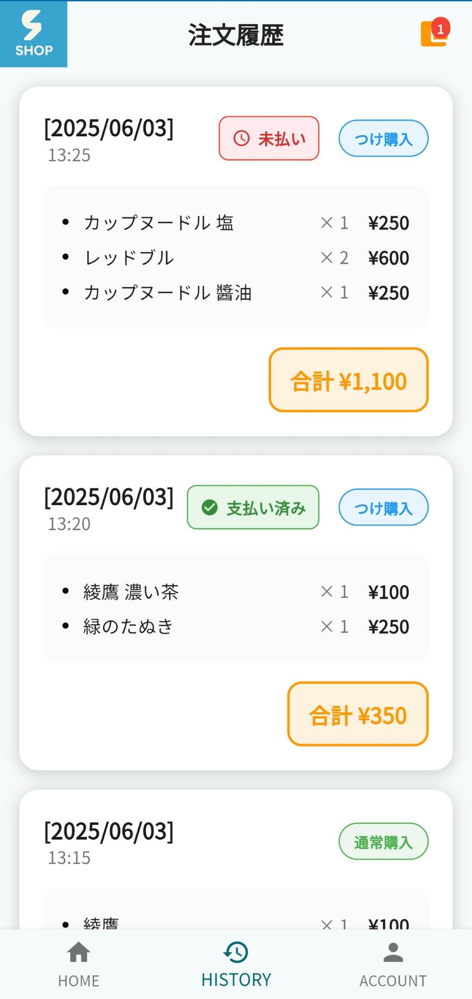

# Chinoshop

<table align="center">
  <tr>
    <td></td>
    <td></td>
    <td></td>
  </tr>
</table>

## 概要 ❘ Overview

私たちの研究室は、最寄りのコンビニまで往復20分弱という立地の課題を抱えていました。
研究室メンバーがより手軽に飲食部を購入できる環境を実現するため、研究室内に無人商店を設立し、そのためのECアプリを開発しました。

当初はスプレッドシートで購入を管理していましたが、スマートフォンでの操作性に課題がありました。そこで、より直感的で利便性の高い体験を提供するため、Flutterを用いてWebアプリケーションとして開発しました。

開発にあたっては、「有料サービスは利用しない」「支払いは現金での直接取引のみ」という制約のもと、コストを意識した設計・実装を行っています。


* **制作期間**: 2025年4月〜2025年5月 (約2ヶ月)

## デモ ❘ Demo
デモサイトで実際にアプリケーションを操作できます。
* **URL**: [https://portfoliochinoshop.web.app](https://portfoliochinoshop.web.app)
* **テスト用ゲストアカウント**:
    * Email: `chinoshop.p.guest@gmail.com`
    * Password: `chinoshop`
 
* **テスト用管理者アカウント**:
    * セキュリティの観点から、管理者アカウント情報をご希望の方はお問い合わせください。

---

## 主な機能 ❘ Features

### ユーザー向け
* 認証: Firebase AuthenticationによるGoogle認証
* HOMEタブ
  * 商品一覧・詳細表示
  * 商品検索・カテゴリーフィルター
  * カート機能（通常購入とツケ購入 ※ツケに関しては後述）
* HISTORYタブ
  * 注文履歴の確認
  * ツケ購入の支払いステータス確認
  * 未払いの総ツケ金額の確認
* ACCOUNTタブ
  * ユーザー名の変更
  * ログアウト

### 管理者向け
* ユーザー管理
  * ユーザー一覧（ユーザー名・ロール）の確認
  * ユーザーの削除
* 商品管理
  * 商品の追加・編集（商品名、価格、説明、カテゴリー等）
  * 在庫調整
  * 商品の表示切替（ユーザー側への表示）
* 資金管理
  * 金庫残高の確認
  * 取引履歴（購入や仕入れによる入出金）の確認
  * 手動での入出金
  * ツケの支払いステータス変更（未払い→支払い済み）

---

## 技術スタック ❘ Tech Stack

* **フロントエンド**: Flutter 3.32.2, Dart 3.8.1
* **バックエンド**: 
    * Firebase Authentication: ユーザー認証
    * Cloud Firestore: データベース
    * Firebase Hosting: Webアプリケーションのホスティング
* **その他**: 
    * Python: 商品画像のBase64エンコード処理に使用

---

## 開発ハイライト ❘ Highlights

### 1. 維持費ゼロでの運用を実現
本プロジェクトは薄利多売なビジネスモデルを想定しており、手数料や維持費を極力抑える必要がありました。そのため、Cloud Functionsのような有料サービスを利用せず、複雑なロジックもすべてクライアントサイド（Flutter/Dart）で実装しました。これにより、サーバーレス開発の知見を深めると同時に、将来的な引き継ぎのしやすさも考慮した設計となっています。

### 2. ツケ購入によるUX向上
研究室内での少額・高頻度の決済を想定し、ユーザーの利便性を最大化するために「ツケ払い」機能を実装しました。これは、購入時に現金のやり取りをせず、後でまとめて精算する仕組みです。この機能により、ユーザーは気軽に商品を購入でき、売上向上にも繋がります。

### 3. 在庫の整合性を担保するバッチ処理
複数ユーザーが同時に同じ商品を購入しようとした際に、在庫数を超えて購入できてしまう「売り越し」を防ぐため、Cloud Firestoreのバッチ書き込みを活用しました。これにより、在庫の確認から購入記録、在庫数の更新までの一連の処理をアトミックに実行し、データの整合性を担保しています。

### 4. レスポンシブデザインへの対応
スマートフォン（縦画面）とPC（横画面）の両方での利用を想定し、レイアウトが最適化される簡易的なレスポンシブデザインを実装しました。

---

## 今後の展望 (Future Work)
* **Firestoreのセキュリティルールの強化**: 現在よりも詳細なルールを定義し、セキュリティを向上させる。
* **画像アップロード機能の実装**: 現在はローカルのPythonスクリプトで画像をBase64文字列に変換し、それを手動でFirestoreに保存している。将来的にはFirebase Storageを導入し、アプリ上から直接画像をアップロードできる仕組みを検討する。
* **ドメイン指定での認証**: 特定のメールドメインを持つユーザーのみが登録・ログインできるように制限し、学内での利用に特化させる。

---

## ツリー構造（Appendix）

一部省略したツリー構造を添付します。

``` text
.
|   .firebaserc
|   .flutter-plugins-dependencies
|   .gitignore
|   .metadata
|   analysis_options.yaml
|   chinoshop.iml
|   firebase.json
|   firestore.indexes.json
|   pubspec.lock
|   pubspec.yaml
|   README.md
|
+---.dart_tool
|
+---.firebase
|
+---.github
|
+---.idea
|
+---android
|
+---assets
|   \---images
|           guest_user_icon.png
|           ios_light_rd_SI@4x.png
|           SHOP_logo0.png
|
+---ios
|
+---lib
|   |   firebase_options.dart
|   |   main.dart
|   |
|   +---constants
|   |       admin_constants.dart
|   |       app_constants.dart
|   |
|   +---images
|   |       no_img_base64.dart
|   |
|   +---models
|   |       order_item_model.dart
|   |       order_model.dart
|   |       transaction_model.dart
|   |
|   +---pages
|   |   +---admin
|   |   |       admin_inventory_page.dart
|   |   |       admin_main_page.dart
|   |   |       admin_money_management_page.dart
|   |   |       admin_user_management_page.dart
|   |   |
|   |   +---auth
|   |   |       auth_check.dart
|   |   |       auth_gate.dart
|   |   |       auth_login.dart
|   |   |       auth_user_profile_setup_page.dart
|   |   |
|   |   \---main
|   |           account_detail.dart
|   |           account_detail_page.dart
|   |           cart_page.dart
|   |           home.dart
|   |           navigation_page.dart
|   |           order_history_page.dart
|   |
|   +---services
|   |       admin_inventory_service.dart
|   |       admin_transaction_service.dart
|   |       admin_user_service.dart
|   |       cart_service.dart
|   |       order_service.dart
|   |
|   +---utils
|   |       admin_formatter.dart
|   |       order_utils.dart
|   |
|   \---widgets
|           admin_dialog.dart
|           admin_empty_state.dart
|           admin_filter_chip_list.dart
|           balance_card.dart
|           cart_badge.dart
|           common_app_bar.dart
|           custom_error_widget.dart
|           edit_transaction_dialog.dart
|           empty_orders_widget.dart
|           item_detail_dialog.dart
|           loading_widget.dart
|           manual_transaction_dialog.dart
|           order_card.dart
|           order_items_widget.dart
|           top_banner_widget.dart
|           transaction_card.dart
|           unpaid_total_button.dart
|           unpaid_total_dialog.dart
|
+---linux
|
+---macos
|
+---readme_screenshots
|       screenshot_home.jpg
|       screenshot_login.jpg
|       screenshot_order_history.jpg
|
+---test
|
+---web
|   |   favicon.png
|   |   index.html
|   |   manifest.json
|   |
|   \---icons
|           Icon-192.png
|           Icon-512.png
|           Icon-maskable-192.png
|           Icon-maskable-512.png
|
\---windows